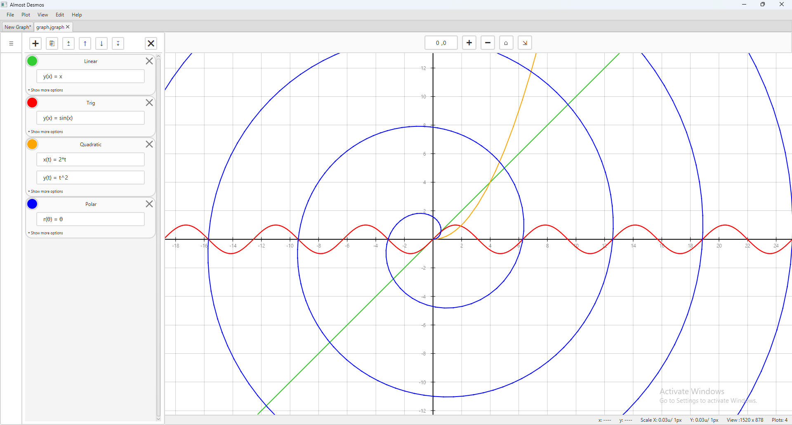
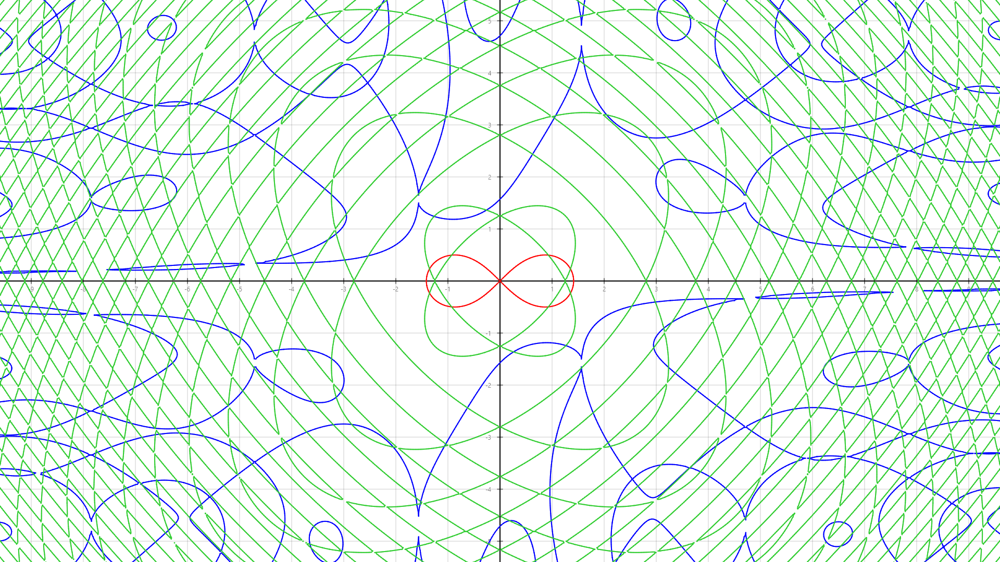
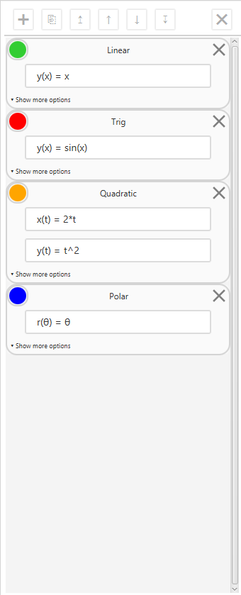

# Graphing Calculator



A desktop graphing calculator built with Java and JavaFX.
The application supports multiple plot types, saving/loading, image export, and interactive graph exploration.

## Features

- Function plots
- Parametric plots
- Polar plots
- Implicit plots
- Expression parsing
- Zoom and pan
- Curve inspection
- Undo / redo
- Save and open projects
- Image export

## Screenshots

### Exported Graph



Graphs can be exported as PNG images with optional transparent backgrounds.

### Plot Editor



The editor allows creation and configuration of multiple types within a single project.

## Implementation

The application is built from scratch using Java and JavaFX.

Major components include:
- Custom mathematical lexer and parser written from scratch
- Plot model system
- Rendering pipeline for curves, axes, grids, and overlays
- Adaptive curve rendering
- Camera/viewport system with zooming and panning
- Command-based Undo/Redo system
- JSON-based project saving and loading using Jackson

### Expression Parser

The application uses a custom mathematicaly expression parser built from scratch.

The parser pipeline consists of:

- Lexing: converts text expressions into tokens
- Parsing: converts tokens into an expression tree
- Evaluation: computes values during plotting

The parser uses a recursive descent approach to build an abstract syntax tree.

The parser supports:
- Arithmetic operations
- Variables
- Functions
- Operator precedence
- Parentheses

## Project Structure

```text
src/
├── app             Application entry point
├── interaction     Input handling and undo/redo
├── math            Mathematical utilities
├── parser          Expression parsing
├── persistence     Project saving/loading
├── plotting        Plot models and curve generation
├── rendering       Canvas rendering pipeline
├── scene           Scene coordination
├── settings        Configuration
└── ui              JavaFX interface
```

## Running

### Requirements 

- Java 21 or newer

### From Release

1. Download the latest release
2. Extract the archive
3. Run `run.bat`.

### From Source

Open the project in VS Code and run the application from the `app.Main` class.

## Usage

1. Create a new plot from the plot editor.
2. Enter an expression.
3. Use the mouse to pan and zoom.
4. Save projects or export graphs from the file menu.

## Future Improvements

Possible future additions:

- Additional plotting features
- Performance improvements for complex implicit plots
- More customization options
- Improved project management

## License

This project is licensed under the MIT License.
See the LICENSE file for details.